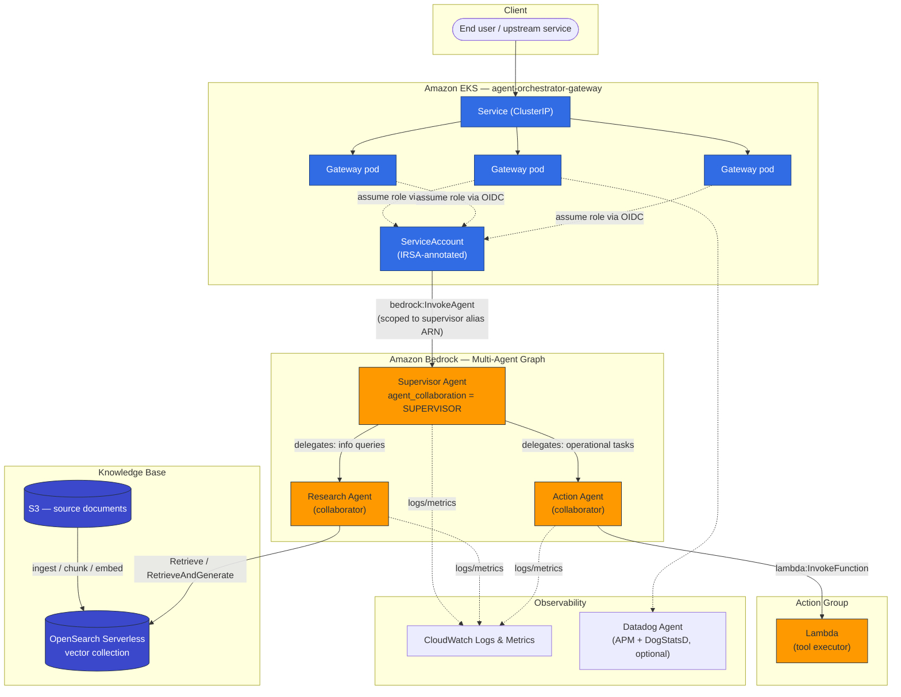

# Bedrock Multi-Agent Orchestration Framework

[](https://www.terraform.io/)
[](https://aws.amazon.com/bedrock/)
[](../../actions/workflows/deploy.yml)
[](LICENSE)
[](#security--zero-trust-iam)

Production-grade Infrastructure-as-Code for an AWS Bedrock multi-agent
orchestration platform: a **supervisor agent** routes requests to
specialist **collaborator agents** (a knowledge-base-grounded research
agent and a Lambda-tool-executing action agent), fronted by a Helm-deployed
gateway on EKS. Everything below is real, provider-verified Terraform --
not pseudocode.

## Table of contents

- [Architecture](#architecture)
- [Key features & design decisions](#key-features--design-decisions)
- [Repository layout](#repository-layout)
- [Prerequisites](#prerequisites)
- [Quick start](#quick-start)
- [CI/CD pipeline](#cicd-pipeline)
- [Security & zero-trust IAM](#security--zero-trust-iam)
- [Cost & cleanup](#cost--cleanup)
- [Related reference architectures](#related-reference-architectures)
- [Disclaimer](#disclaimer)

## Architecture



**Request path:** client → EKS `Service` → gateway pod (IRSA-authenticated,
no static AWS credentials) → `bedrock:InvokeAgent` on the **supervisor
agent's alias ARN only** → supervisor delegates to the research agent
(grounded answers via the OpenSearch Serverless knowledge base) or the
action agent (Lambda-executed operational tasks). Full request-path and
cost breakdown: [`docs/ARCHITECTURE.md`](docs/ARCHITECTURE.md).

## Key features & design decisions

**Wrap proven modules instead of reinventing them.** The Bedrock agent /
knowledge base / action group / guardrail surface is provisioned through
[`aws-ia/bedrock/aws`](https://registry.terraform.io/modules/aws-ia/bedrock/aws/latest)
(AWS's own Integration & Automation team module), and EKS through
[`terraform-aws-modules/eks/aws`](https://registry.terraform.io/modules/terraform-aws-modules/eks/aws/latest)
(the de-facto community standard, 4,000+ GitHub stars). This repo's modules
in `terraform/modules/` are thin, opinionated wrappers around those --
pinning versions, applying this org's tagging/validation conventions, and
keeping the composition point in one reviewable place. The one deliberate
exception is multi-agent supervisor/collaborator wiring
(`terraform/modules/bedrock-supervisor`), which uses the native
`hashicorp/aws` provider resources directly — see
[ADR-style rationale in docs/ARCHITECTURE.md](docs/ARCHITECTURE.md#why-a-community-module-wrapper-instead-of-hand-rolled-resources).

**Zero-trust IAM, everywhere.** No static AWS access keys exist in this
repo or its pipeline. CI/CD authenticates to AWS via GitHub's OIDC identity
provider; the EKS gateway authenticates via IRSA (IAM Roles for Service
Accounts) with a trust policy scoped to one exact
`namespace:serviceaccount` pair; every Bedrock agent's execution role is
scoped to only the foundation model, knowledge base, and collaborator ARNs
it actually needs — see [Security & zero-trust IAM](#security--zero-trust-iam).

**Environment-appropriate topology, not one-size-fits-all.** `dev` is a
single agent + knowledge base + action group — no EKS, no multi-agent
graph — for a fast, cheap iteration loop on instructions and tools. `prod`
is the full supervisor/collaborator graph behind the EKS gateway. Same
modules, different composition — see `terraform/environments/`.

**RAG optimization.** Fixed-size chunking (512 tokens / 20% overlap by
default, tunable per knowledge base) balances retrieval precision against
context-window cost; OpenSearch Serverless's IAM-native data-access
policies mean no separate database credentials exist to rotate or leak.

**Remote state locking.** S3 backend with a DynamoDB lock table
(`terraform/bootstrap`), provisioned once per account and referenced via
`-backend-config` at `init` time so the same `backend.tf` works unmodified
across environments and CI.

**Dynamic tagging.** Every environment computes `local.tags` by merging a
caller-supplied map with `Environment`, `ManagedBy`, `CostCenter`, and
`Project` — applied via provider `default_tags` so no resource can be
created untagged.

## Repository layout

```text
.
├── .github/workflows/deploy.yml      # PR validate + main-branch apply, OIDC auth
├── .tflint.hcl, .checkov.yaml        # Lint / security-scan configuration
├── docs/
│   ├── ARCHITECTURE.md               # Request path, scope boundaries, cost notes
│   └── adr/                          # Architecture decision records
├── helm/agent-orchestrator-gateway/  # EKS gateway chart (IRSA, HPA, PDB, Datadog sidecar)
├── scripts/plan.sh, apply.sh         # Local convenience wrappers
└── terraform/
    ├── bootstrap/                    # One-time: S3 state bucket + DynamoDB lock table
    ├── modules/
    │   ├── bedrock-agent-wrapper/    # Wraps aws-ia/bedrock/aws: agent + KB + action group + guardrail
    │   ├── bedrock-supervisor/       # Native multi-agent supervisor/collaborator wiring
    │   ├── eks/                      # Wraps terraform-aws-modules/eks/aws
    │   └── irsa/                     # Wraps the community IRSA-for-EKS submodule
    └── environments/
        ├── dev/                      # Single agent + KB + action group (no EKS)
        └── prod/                     # Full supervisor + 2 collaborators + EKS gateway
```

## Prerequisites

| Tool | Version | Purpose |
|---|---|---|
| [Terraform](https://developer.hashicorp.com/terraform/downloads) or [OpenTofu](https://opentofu.org/) | >= 1.7 | Provisioning |
| [AWS CLI](https://aws.amazon.com/cli/) | v2 | Auth / debugging |
| [kubectl](https://kubernetes.io/docs/tasks/tools/) | matching EKS minor version | Cluster access |
| [Helm](https://helm.sh/docs/intro/install/) | >= 3.14 | Gateway chart deploy |
| [tflint](https://github.com/terraform-linters/tflint) | >= 0.53 | Lint (matches CI) |
| [checkov](https://www.checkov.io/) | >= 3.2 | Security scan (matches CI) |

You'll also need: an AWS account with Bedrock model access granted for the
foundation model you configure, an existing VPC with tagged private
subnets (see [`docs/ARCHITECTURE.md`](docs/ARCHITECTURE.md#whats-intentionally-out-of-scope)),
and the state backend from `terraform/bootstrap` applied once per account.

## Quick start

```bash
# 1. One-time per AWS account: create the remote state backend.
cd terraform/bootstrap
terraform init
terraform apply -var="state_bucket_name=acme-terraform-state-dev"
cd -

# 2. Configure the dev environment.
cd terraform/environments/dev
cp terraform.tfvars.example terraform.tfvars
# edit terraform.tfvars: deployment_role_arn, cost_center, kb_data_source_bucket_name

# 3. Init, plan, apply.
terraform init \
  -backend-config="bucket=acme-terraform-state-dev" \
  -backend-config="key=bedrock-agent-orchestration/dev/terraform.tfstate" \
  -backend-config="region=us-east-1" \
  -backend-config="dynamodb_table=terraform-state-locks"

terraform plan -out=tfplan.binary
terraform apply tfplan.binary

# 4. (prod only) Deploy the EKS gateway once the cluster exists.
aws eks update-kubeconfig --name "$(terraform output -raw eks_cluster_name)"
helm upgrade --install agent-orchestrator-gateway ../../../helm/agent-orchestrator-gateway \
  --namespace agent-orchestrator --create-namespace \
  -f ../../../helm/agent-orchestrator-gateway/values.yaml \
  -f ../../../helm/agent-orchestrator-gateway/values-prod.yaml \
  --set serviceAccount.annotations."eks\.amazonaws\.com/role-arn"="$(terraform output -raw gateway_irsa_role_arn)"
```

Or use the convenience wrappers: `./scripts/plan.sh dev` then
`./scripts/apply.sh dev`.

## CI/CD pipeline

`.github/workflows/deploy.yml` runs two stages:

- **`validate`** (every PR touching `terraform/`): `terraform fmt -check`,
  `tflint`, `checkov`, `tfsec`, `terraform plan` — matrixed across `dev` and
  `prod`, plan output posted as a PR comment. Uses a **read-only, plan-only**
  OIDC role; nothing here can mutate infrastructure.
- **`apply`** (push to `main`, or manual `workflow_dispatch`): assumes a
  separate, more privileged OIDC role per environment, gated by a
  [GitHub Environment](https://docs.github.com/en/actions/deployment/targeting-different-environments/using-environments-for-deployment)
  (configure required reviewers there for `prod`), with
  `concurrency: { group: terraform-apply-<env>, cancel-in-progress: false }`
  so two applies against the same state can never race.

No AWS access keys are stored as GitHub secrets — only the OIDC role ARNs
(`AWS_PLAN_ROLE_ARN_*`, `AWS_APPLY_ROLE_ARN_*`) and state backend
identifiers (`TF_STATE_BUCKET_*`). Configure the GitHub OIDC identity
provider's trust policy on those roles to
`token.actions.githubusercontent.com`, scoped to this repo and branch.

## Security & zero-trust IAM

- **No static credentials anywhere** — CI uses OIDC federation to AWS; the
  EKS gateway uses IRSA; every module's execution role is created fresh per
  agent/Lambda, not shared.
- **Least privilege by construction**: the gateway's IRSA role can call
  `bedrock:InvokeAgent` on exactly the supervisor's alias ARN (see
  `terraform/modules/irsa/main.tf`); each agent's role can invoke exactly
  its foundation model, its knowledge base, and (for the supervisor) exactly
  its collaborators' alias ARNs — never a wildcard resource.
- **Encryption at rest**: EKS secrets (KMS envelope encryption via the
  upstream module), OpenSearch Serverless collections, S3 buckets, and
  Lambda environment variables all support a customer-managed KMS key
  (`kms_key_arn` variable, threaded through every module).
  Guardrails (content filters for hate/insults/sexual/violence/misconduct/
  prompt-injection) are available via `create_guardrail` on the agent
  wrapper and wired to the supervisor in `prod`.
- **Network**: EKS API endpoint is private by default
  (`endpoint_public_access = false`); Lambda action-group functions are
  invocable only by `bedrock.amazonaws.com` scoped to this account's agent
  ARNs (`aws_lambda_permission` with a `source_arn` condition).

## Cost & cleanup

Destroy in reverse dependency order — Helm release first (it references
IAM/agent resources Terraform manages), then Terraform:

```bash
helm uninstall agent-orchestrator-gateway -n agent-orchestrator

cd terraform/environments/prod   # or dev
terraform destroy

# Only after every environment using it is destroyed:
cd ../../bootstrap
terraform destroy
```

See [`docs/ARCHITECTURE.md#cost-notes`](docs/ARCHITECTURE.md#cost-notes)
for what actually drives spend (OpenSearch Serverless OCUs and the EKS
control-plane hourly charge are the two fixed costs; Bedrock invocation is
usage-based). `dev` skips EKS entirely to keep the iteration loop cheap.

## Related reference architectures

This repo intentionally stays scoped to the agent/EKS-gateway layer. For
adjacent concerns, these are the references this design assumes sit
underneath or beside it:

- [`aws-landing-zone-foundation`](https://github.com/balakrishnagatla/aws-landing-zone-foundation) — the foundational layer this repo assumes already exists: AWS Organizations + SCP guardrails, per-account VPC/NAT, and the CloudTrail/Config/GuardDuty baseline. Deploy that repo first, then this one.
- [`aws-ia/terraform-aws-eks-blueprints`](https://github.com/aws-ia/terraform-aws-eks-blueprints) — cluster-platform layer (Karpenter, GitOps tooling, observability operators) if you're running many workloads on shared EKS clusters, not just this one.
- [`aws-samples/bedrock-agents-for-eks`](https://github.com/aws-samples/bedrock-agents-for-eks) — an AWS sample combining EKS and Bedrock Agents from a different angle, useful for cross-checking design choices.
- [`aws-samples/aws-startup-landing-zone-terraform-example`](https://github.com/aws-samples/aws-startup-landing-zone-terraform-example) — AWS's own reference pattern for the landing-zone layer above.

## Disclaimer

Note: This repository contains open-source platform architecture patterns
and modular IaC code maintained for portfolio and reference purposes.
Module versions, IAM policies, and default values should be reviewed
against your own organization's security and compliance requirements
before any production use.
